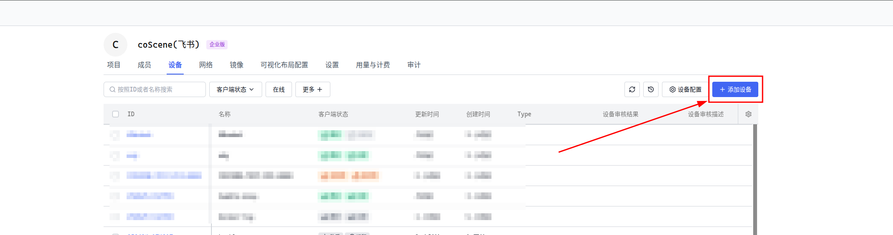
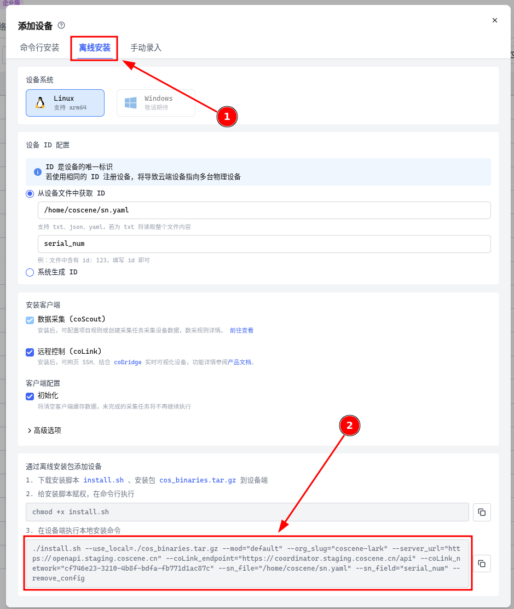

# edge-software
本repo提供刻行时空全量端侧软件的安装包，并提供版本号查询能力。 用户可以根据自身需求，对刻行端侧软件进行安装并完成版本校验。


## 如何使用

### 环境准备
1. 您的机器人本体上需要提前安装好 Ros
2. 您的机器人本体上需要设置好 Ros 的环境变量，并提前 source

### 安装步骤
1. 下载repo中的 /script/install.sh 文件并给这个文件添加可执行的权限，以及 [cos_binaries.tar.gz](https://github.com/coscene-io/edge-software/releases/download/v0.9.3/cos_binaries.tar.gz) 软件包
2. 使用如下命令进行安装： 
   ```bash
   ./install.sh --use_local=./cos_binaries.tar.gz \
       --mod="default" \
       --org_slug="coscene-lark" \
       --server_url="https://openapi.staging.coscene.cn" \
       --coLink_endpoint="https://coordinator.staging.coscene.cn/api" \
       --coLink_network="cf746e23-3210-4b8f-bdfa-fb771d1ac87c" \
       --sn_file="/home/just2004docker/Downloads/example.yaml" \
       --sn_field="serial_num" \
       # --remove_config  注意：此参数仅适用，用户需要强制重新安装机器的端侧软件，启用此参数，重新安装后，机器人需要在刻行时空平台重新准入。请谨慎使用！
   ```
   
   以上命令中的 parameter 可以在 coscene 网站的 “组织设置” -> “设备” 中获取，实际使用时请根据
   
   
   
    
3. 根据用户的实际需求，可将此命令封装成适合您的安装脚本或程序。 

### 设备自检

当您的上述操作遇到问题时，可以在设备端执行下述命令

```bash
bash <(wget -qO - https://download.coscene.cn/cosbinary/script/beta/device-check.sh)
```

将输出结果截图发给刻行人员，然后协助解答您的疑问。

## 获取当前已安装的组件版本
```bash
./script/install.sh --version
```
   
如果系统内已经安装组件，会有以下输出：

```bash
# coScene Edge Software Package Versions
# Generated on: 2025-06-25 08:42:54 UTC

release_version: v1.0.0
assemblies:
  colink_version: 1.0.4
  cos_version: latest
  colistener_version: 2.0.0-0
  cobridge_version: 1.0.9-0
  trzsz_version: 1.1.6
```

   release_version： 整体版本号
   
   assemblies： 各个组件子版本号

如果未安装：
```bash
no version file was found.
```

可根据实际情况，对刻行时空的软件版本进行校验。 刻行时空建议对 
```bash
release_version: v1.0.0
```
进行校验。

## 配置启动文件
```bash
  colink:  无需单独配置
  cos: 无需单独配置
  colistener_version:  #请务必在启动前先 source 您的 ros 工作空间环境变量。
     Ros1： roslaunch colistener colistener.launch 
     Ros2： ros2 launch colistener colistener.launch.xml   
  cobridge:  #请务必在启动前先 source 您的 ros 工作空间环境变量。
     Ros1： roslaunch cobridge cobridge.launch
     Ros2： ros2 launch cobridge cobridge_launch.xml   
  trzsz：无需单独配置
```
启动程序也可封装到您自己的启动脚本中

## 其他

当您的机器处于内网，不能够直接访问外网，但是存在着统一的出口代理服务时，采集软件支持通过 --http_proxy 参数设置通过代理服务访问。安装参数如下

```bash
./install.sh --use_local=./cos_binaries.tar.gz \
      --mod="default" \
      --org_slug="coscene-lark" \
      --server_url="https://openapi.staging.coscene.cn" \
      --coLink_endpoint="https://coordinator.staging.coscene.cn/api" \
      --coLink_network="cf746e23-3210-4b8f-bdfa-fb771d1ac87c" \
      --sn_file="/home/just2004docker/Downloads/example.yaml" \
      --sn_field="serial_num" \
      # --remove_config  注意：此参数仅适用，用户需要强制重新安装机器的端侧软件，启用此参数，重新安装后，机器人需要在刻行时空平台重新准入。请谨慎使用！
      --http_proxy=http://proxy
```

另外如果没有响应的代理软件，我们也提供了一个代理服务的安装，具体可以通过 [install-proxy.sh](./script/install-proxy.sh) 脚本安装。

```bash
./install-proxy.sh --listen_port=12345
```

其中 --listen_port=12345 参数用于指定代理服务的端口，建议使用大于 10000 以上的端口避免服务冲突。
